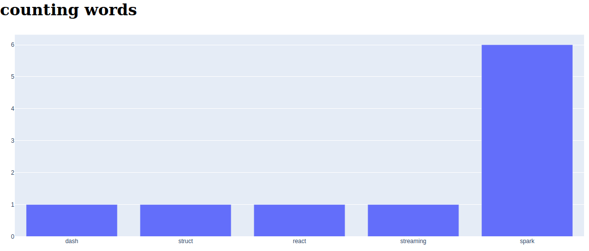

# Creating Dashboad with Dash

### Dash is a high level python package for creating dashboards. it uses Flask under the hood for creating an online page. Also it uses React.js.

you can run project with uwsgi, simply run ./run_uwsgi.sh.

